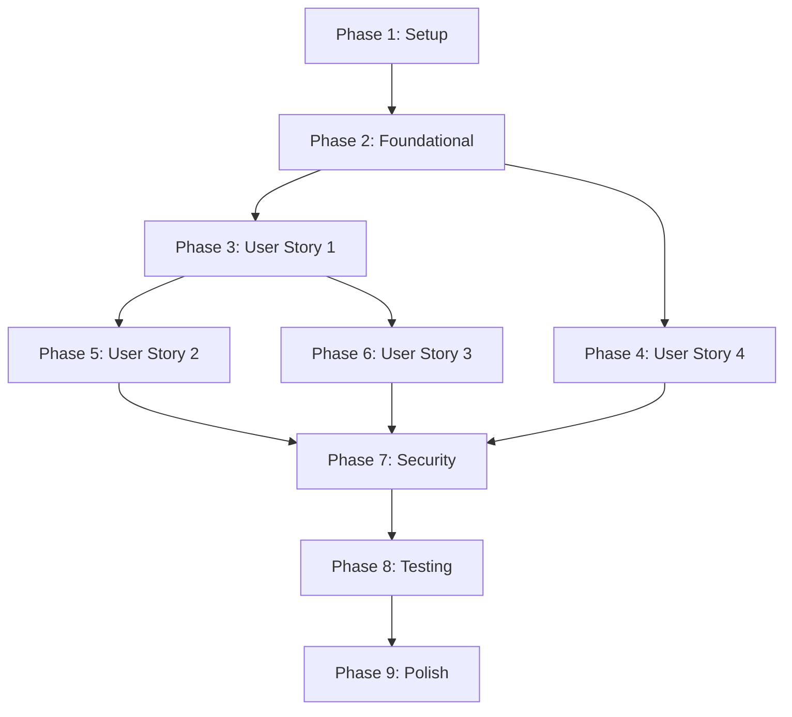

# Tasks: Google OAuth Authentication Integration

**Feature**: 012-google-oauth-auth
**Branch**: `012-google-oauth-auth`
**Generated**: 2025-12-26
**Plan**: [plan.md](./plan.md) | **Spec**: [spec.md](./spec.md)

## Overview

This task list implements Google OAuth 2.0 authentication as an additional sign-in method alongside existing email/password authentication. Tasks are organized by user story priority to enable independent implementation and testing. Each user story phase is independently testable and delivers incremental value.

## Task Format

All tasks follow this format:
```
- [ ] [TaskID] [P] [Story] Description with file path
```

- **TaskID**: T001, T002, etc. (sequential in execution order)
- **[P]**: Parallelizable marker (task can run in parallel with others)
- **[Story]**: User story label [US1], [US2], [US3], [US4] (omitted for Setup/Foundational/Polish phases)
- **Description**: Clear action with specific file paths

## Implementation Strategy

**MVP Scope**: Phase 3 (User Story 1 + User Story 4) - Enables new Google OAuth signup while maintaining backward compatibility

**Incremental Delivery**:
1. MVP: US1 + US4 (Google signup + backward compatibility)
2. Enhancement: US2 (Existing Google user sign-in)
3. Advanced: US3 (Account linking)

**Independent Testing**: Each user story phase can be tested independently with the test criteria provided in that phase.

---

## Phase 1: Setup & Environment Configuration

**Goal**: Prepare project environment, dependencies, and Google OAuth credentials

### Tasks

- [ ] T001 Add google-auth and google-auth-oauthlib to backend/pyproject.toml dependencies
- [ ] T002 [P] Install backend dependencies using UV package manager
- [ ] T003 [P] Add GOOGLE_OAUTH_CLIENT_ID and GOOGLE_OAUTH_CLIENT_SECRET to backend/.env.example
- [ ] T004 [P] Add NEXT_PUBLIC_GOOGLE_OAUTH_CLIENT_ID to frontend/.env.local.example
- [ ] T005 [P] Document Google Cloud Console setup in specs/012-google-oauth-auth/quickstart.md
- [ ] T006 Verify Better Auth is installed in frontend/package.json (already present from existing auth)

---

## Phase 2: Foundational - Database Schema & Core Services

**Goal**: Extend database schema and implement core OAuth verification service (blocking for all user stories)

### Tasks

- [ ] T007 Create database migration file backend/alembic/versions/add_oauth_fields.py to add auth_provider, google_id, oauth_data columns to User table
- [ ] T008 Update User model in backend/models.py with auth_provider, google_id, oauth_data fields and make password_hash nullable
- [ ] T009 [P] Apply database migration to add OAuth fields (run alembic upgrade head)
- [ ] T010 [P] Create backend/services/oauth_service.py with verify_google_token() function using google-auth library
- [ ] T011 [P] Add GoogleOAuthCallback and GoogleLinkConfirm Pydantic schemas to backend/schemas/auth.py
- [ ] T012 Configure Better Auth Google provider in frontend/lib/auth.ts with client ID and callback URL

**Completion Criteria**:
- Database has auth_provider, google_id columns
- User model updated with OAuth fields
- Google token verification service exists
- Better Auth configured for Google OAuth

---

## Phase 3: User Story 1 - New User Signs Up with Google (P1)

**Story Goal**: Enable new users to sign up using their Google account without creating a password

**Independent Test**: Click "Sign in with Google" button → complete Google OAuth consent → verify new user created with auth_provider='google' → redirected to /tasks with valid JWT token

### Tasks

- [ ] T013 [US1] Implement POST /auth/google/callback endpoint in backend/routes/auth.py to handle OAuth callback
- [ ] T014 [US1] Add create_user_from_google_profile() function in backend/services/oauth_service.py to create new user from Google claims
- [ ] T015 [US1] Add google_id uniqueness validation in OAuth callback endpoint
- [ ] T016 [P] [US1] Create frontend/components/GoogleOAuthButton.tsx component with "Sign in with Google" button
- [ ] T017 [P] [US1] Add GoogleOAuthButton to frontend/app/auth/page.tsx authentication page
- [ ] T018 [P] [US1] Add OAuth success handler in frontend/lib/auth.ts to redirect to /tasks after successful authentication
- [ ] T019 [US1] Add OAuth cancellation error handling in frontend/components/GoogleOAuthButton.tsx
- [ ] T020 [US1] Test new user Google OAuth signup flow end-to-end

**Acceptance Criteria (US1)**:
1. User clicks "Sign in with Google" → redirected to Google consent screen
2. User completes consent → callback creates new user with auth_provider='google'
3. User receives JWT token and is redirected to /tasks dashboard
4. User cancellation shows appropriate message

---

## Phase 4: User Story 4 - Backward Compatibility (P1)

**Story Goal**: Ensure existing email/password users can continue signing in without disruption

**Independent Test**: Create email/password user before OAuth → after OAuth feature deployed → verify user can still sign in with email/password → JWT token issued → no changes to workflow

### Tasks

- [ ] T021 [P] [US4] Verify existing POST /auth/login endpoint in backend/routes/auth.py still works with auth_provider='local' users
- [ ] T022 [P] [US4] Add validation in POST /auth/login to reject Google OAuth users trying to sign in with password
- [ ] T023 [P] [US4] Update frontend/app/auth/page.tsx to display both email/password and Google OAuth options side-by-side
- [ ] T024 [US4] Test existing email/password authentication flow with updated UI
- [ ] T025 [US4] Test that Google OAuth users cannot sign in with email/password

**Acceptance Criteria (US4)**:
1. Email/password users see both sign-in options on auth page
2. Email/password authentication works identically to before OAuth feature
3. Google OAuth users are prevented from using email/password sign-in
4. JWT token structure is identical for both auth methods

---

## Phase 5: User Story 2 - Existing Google User Signs In (P2)

**Story Goal**: Enable returning Google OAuth users to sign in quickly on subsequent visits

**Independent Test**: Create user via Google OAuth → log out → click "Sign in with Google" → verify same account authenticated → new JWT token issued → no duplicate account created

### Tasks

- [ ] T026 [US2] Add find_user_by_google_id() query function in backend/services/oauth_service.py
- [ ] T027 [US2] Update POST /auth/google/callback to authenticate existing user if google_id found in database
- [ ] T028 [US2] Add duplicate account prevention logic in OAuth callback (check google_id before creating user)
- [ ] T029 [US2] Test existing Google user sign-in flow (repeat authentication)
- [ ] T030 [US2] Verify JWT token claims are identical between first and subsequent sign-ins

**Acceptance Criteria (US2)**:
1. Existing Google user clicks "Sign in with Google" → authenticated to same account
2. No duplicate user accounts created
3. JWT token issued with consistent user_id and claims
4. Sign-in completes in <15 seconds (performance requirement)

---

## Phase 6: User Story 3 - Account Linking with Confirmation (P3)

**Story Goal**: Allow email/password users to link their Google account with explicit confirmation for security

**Independent Test**: Create email/password user → attempt Google OAuth sign-in with same email → confirmation prompt appears → user confirms → google_id linked to account → both auth methods work

### Tasks

- [ ] T031 [US3] Add find_user_by_email() query function in backend/services/oauth_service.py for account linking detection
- [ ] T032 [US3] Add generate_linking_token() function in backend/services/oauth_service.py to create temporary JWT for confirmation
- [ ] T033 [US3] Update POST /auth/google/callback to return requires_confirmation response when email match detected
- [ ] T034 [P] [US3] Implement POST /auth/google/link-confirm endpoint in backend/routes/auth.py to handle confirmation
- [ ] T035 [P] [US3] Create frontend/components/AccountLinkingDialog.tsx component for confirmation UI
- [ ] T036 [P] [US3] Add account linking confirmation handler in frontend/lib/api.ts to call link-confirm endpoint
- [ ] T037 [US3] Integrate AccountLinkingDialog into frontend OAuth flow
- [ ] T038 [US3] Add link_google_account() function in backend/services/oauth_service.py to update user with google_id
- [ ] T039 [US3] Add validation to prevent linking Google account already linked to different user
- [ ] T040 [US3] Test account linking flow with user confirmation (Yes path)
- [ ] T041 [US3] Test account linking rejection (No path)
- [ ] T042 [US3] Test linked account authentication via both email/password and Google OAuth
- [ ] T043 [US3] Test error handling for Google account already linked to different user

**Acceptance Criteria (US3)**:
1. Email/password user with same email as Google account → confirmation prompt shown
2. User confirms → google_id linked to existing account
3. User rejects → authentication cancelled, returned to sign-in page
4. Linked account can authenticate via both methods
5. Duplicate Google account linking prevented with error message

---

## Phase 7: Security & Error Handling

**Goal**: Implement security measures and comprehensive error handling

### Tasks

- [ ] T044 [P] Add CSRF state parameter validation in POST /auth/google/callback endpoint
- [ ] T045 [P] Add rate limiting to POST /auth/google/callback endpoint (max 10 requests/minute per IP)
- [ ] T046 [P] Add comprehensive error handling for Google API failures in backend/services/oauth_service.py
- [ ] T047 [P] Add OAuth authentication event logging in backend/routes/auth.py
- [ ] T048 [P] Add invalid token signature error handling in verify_google_token()
- [ ] T049 Add expired linking token validation in POST /auth/google/link-confirm
- [ ] T050 Test CSRF protection (invalid state parameter returns 403 Forbidden)
- [ ] T051 Test expired Google ID token handling
- [ ] T052 Test race condition handling (simultaneous Google OAuth signups with same google_id)

**Security Validation**:
- CSRF protection via state parameter validated
- Rate limiting prevents brute-force attacks
- Invalid/expired tokens rejected
- Linking tokens expire after 5 minutes

---

## Phase 8: Testing & Documentation

**Goal**: Comprehensive testing and developer documentation

### Tasks

- [ ] T053 [P] Create backend/tests/test_oauth_service.py with unit tests for token verification
- [ ] T054 [P] Create backend/tests/test_oauth_routes.py with integration tests for OAuth endpoints
- [ ] T055 [P] Create frontend/tests/GoogleOAuthButton.test.tsx with component tests
- [ ] T056 [P] Update backend/tests/test_auth_routes.py to include OAuth-specific scenarios
- [ ] T057 [P] Write end-to-end test for complete OAuth flow in backend/tests/test_oauth_flow_integration.py
- [ ] T058 [P] Document environment variables setup in README.md
- [ ] T059 [P] Create specs/012-google-oauth-auth/quickstart.md with step-by-step OAuth setup guide
- [ ] T060 [P] Update API documentation with OAuth endpoints
- [ ] T061 Run full test suite and verify 100% pass rate
- [ ] T062 Verify mypy type checking passes for all OAuth code

**Test Coverage Goals**:
- Unit tests for oauth_service.py functions
- Integration tests for OAuth endpoints
- Component tests for GoogleOAuthButton
- End-to-end test for full OAuth flow
- 100% code coverage for new OAuth code

---

## Phase 9: Polish & Deployment Preparation

**Goal**: Finalize UI/UX, logging, and deployment readiness

### Tasks

- [ ] T063 [P] Add loading states to frontend/components/GoogleOAuthButton.tsx during OAuth flow
- [ ] T064 [P] Add accessible ARIA labels to Google OAuth button for screen readers
- [ ] T065 [P] Add user-friendly error messages for OAuth failures in frontend
- [ ] T066 [P] Verify WCAG 2.1 AA compliance for OAuth UI components
- [ ] T067 [P] Add performance monitoring for OAuth callback endpoint latency
- [ ] T068 [P] Verify OAuth callback endpoint meets <500ms p95 latency requirement
- [ ] T069 Verify HTTPS requirement documented for production OAuth callback URL
- [ ] T070 Create deployment checklist in specs/012-google-oauth-auth/deployment-checklist.md
- [ ] T071 Verify Google Cloud Console OAuth credentials configured correctly
- [ ] T072 Verify authorized redirect URIs whitelisted in Google Console
- [ ] T073 Final end-to-end testing in staging environment with real Google account

**Deployment Readiness**:
- All tests passing
- Performance requirements met
- Accessibility compliance verified
- Documentation complete
- Deployment checklist prepared

---

## Task Summary

**Total Tasks**: 73 tasks

**Tasks per User Story**:
- Setup (Phase 1): 6 tasks
- Foundational (Phase 2): 6 tasks
- User Story 1 (P1): 8 tasks
- User Story 4 (P1): 5 tasks
- User Story 2 (P2): 5 tasks
- User Story 3 (P3): 13 tasks
- Security (Phase 7): 9 tasks
- Testing (Phase 8): 10 tasks
- Polish (Phase 9): 11 tasks

**Parallel Opportunities**: 42 tasks marked [P] (can run in parallel)

**MVP Scope** (User Stories 1 + 4):
- Setup (T001-T006): 6 tasks
- Foundational (T007-T012): 6 tasks
- US1 (T013-T020): 8 tasks
- US4 (T021-T025): 5 tasks
- Security core (T044-T048): 5 tasks
- Testing core (T053-T054, T061-T062): 4 tasks
- **MVP Total: 34 tasks**

**Enhancement Scope** (Add User Story 2):
- MVP + US2 (T026-T030): +5 tasks
- **Enhancement Total: 39 tasks**

**Full Feature** (Add User Story 3):
- Enhancement + US3 (T031-T043): +13 tasks
- **Full Total: 52 tasks** (before testing/polish)

---

## Dependencies

### User Story Completion Order



### Phase Dependencies

1. **Phase 1 (Setup)**: No dependencies - can start immediately
2. **Phase 2 (Foundational)**: Requires Phase 1 complete (dependencies installed)
3. **Phase 3 (US1)**: Requires Phase 2 complete (database schema, oauth_service)
4. **Phase 4 (US4)**: Requires Phase 2 complete (independent of US1)
5. **Phase 5 (US2)**: Requires US1 complete (builds on new user signup)
6. **Phase 6 (US3)**: Requires US1 complete (builds on OAuth callback logic)
7. **Phase 7 (Security)**: Requires US1, US2, US4 complete
8. **Phase 8 (Testing)**: Requires Phase 7 complete
9. **Phase 9 (Polish)**: Requires Phase 8 complete

### Parallel Execution Examples

**Phase 2 Foundational** (After Setup):
- T010 (oauth_service.py) ∥ T011 (schemas) ∥ T012 (Better Auth config)
- Run in parallel after T007-T009 (database) complete

**Phase 3 User Story 1** (Backend and Frontend):
- T016 (GoogleOAuthButton.tsx) ∥ T017 (auth page) ∥ T018 (success handler)
- Run in parallel with T013-T015 (backend implementation)

**Phase 7 Security**:
- T044 (CSRF) ∥ T045 (rate limiting) ∥ T046 (error handling) ∥ T047 (logging) ∥ T048 (token errors)
- All can run in parallel

**Phase 8 Testing**:
- T053 (unit tests) ∥ T054 (integration tests) ∥ T055 (frontend tests) ∥ T056 (update tests)
- All test creation tasks can run in parallel

---

## Independent Test Criteria

### User Story 1 (New User Signup)
```gherkin
Given a user has never registered before
When they click "Sign in with Google" and complete Google consent
Then a new user account is created with auth_provider='google'
  And google_id is stored from Google profile
  And user is redirected to /tasks with valid JWT token
  And JWT token contains user_id, email, standard claims
```

### User Story 4 (Backward Compatibility)
```gherkin
Given a user signed up with email/password before OAuth feature
When they visit sign-in page after OAuth deployment
Then they can still sign in with email/password
  And JWT token structure is unchanged
  And both auth options are visible on sign-in page
  And Google OAuth users cannot use email/password sign-in
```

### User Story 2 (Existing Google User)
```gherkin
Given a user previously signed up via Google OAuth
When they click "Sign in with Google" on subsequent visit
Then system finds existing user by google_id
  And system does NOT create duplicate account
  And system issues new JWT token for same user_id
  And authentication completes in <15 seconds
```

### User Story 3 (Account Linking)
```gherkin
Given a user has email/password account with email "john@gmail.com"
When they attempt Google OAuth sign-in with same email
Then system displays confirmation prompt with Yes/No buttons
  And if user confirms, google_id is linked to existing account
  And if user rejects, authentication is cancelled
  And linked account can sign in via both methods
  And duplicate Google account linking is prevented
```

---

## Validation Checklist

- [X] All tasks follow checklist format (checkbox, TaskID, [P], [Story], description, file path)
- [X] Tasks organized by user story priority (P1, P2, P3)
- [X] Each user story phase has independent test criteria
- [X] Parallel opportunities identified (42 tasks marked [P])
- [X] MVP scope clearly defined (User Stories 1 + 4)
- [X] Dependencies documented with completion order graph
- [X] File paths specified for all implementation tasks
- [X] Testing tasks included for all user stories
- [X] Security and error handling tasks included
- [X] Documentation and deployment tasks included

---

**Status**: ✅ Ready for Implementation
**Next Command**: `/sp.implement` to execute tasks using agents/skills
