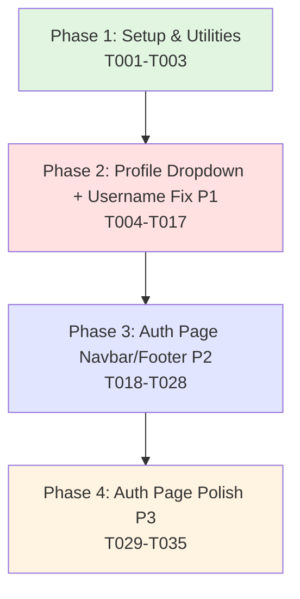

# Tasks: Profile Dropdown Menu and Auth Page UI Enhancement

**Feature**: 012-profile-dropdown-ui
**Branch**: `012-profile-dropdown-ui`
**Generated**: 2025-12-27
**Plan**: [plan.md](./plan.md) | **Spec**: [spec.md](./spec.md)

## Overview

This task list implements profile dropdown menu for logout, fixes username display in navbar, adds navbar/footer to auth page, and polishes the auth page UI/UX. Tasks are organized by user story priority to enable independent implementation and testing.

## Task Format

All tasks follow this format:
```
- [ ] [TaskID] [P] [Story] Description with file path
```

- **TaskID**: T001, T002, etc. (sequential in execution order)
- **[P]**: Parallelizable marker (task can run in parallel with others)
- **[Story]**: User story label [US1], [US2], [US3], [US4] (omitted for Setup/Polish phases)
- **Description**: Clear action with specific file paths

## Implementation Strategy

**MVP Scope**: Phase 2 (User Story 1 + User Story 2) - Profile dropdown and username fix

**Incremental Delivery**:
1. MVP: US1 + US2 (Profile dropdown with correct username display)
2. Enhancement: US3 (Auth page navbar and footer)
3. Polish: US4 (Smooth animations and transitions)

**Independent Testing**: Each user story phase can be tested independently with the test criteria provided.

---

## Phase 1: Setup & Utilities

**Goal**: Create reusable utilities and helper functions

### Tasks

- [ ] T001 [P] Create frontend/lib/utils/getUserDisplayName.ts utility to extract display name from user data (oauth_data.name → username → email fallback)
- [ ] T002 [P] Create frontend/lib/hooks/useClickOutside.ts custom hook for click-outside detection in dropdowns
- [ ] T003 [P] Add TypeScript interface for ProfileDropdown component props in frontend/types/components.ts (optional - can use inline types)

---

## Phase 2: User Story 1 + 2 - Profile Dropdown and Username Fix (P1)

**Story Goal**: Replace standalone logout button with profile dropdown menu and display correct username/full name in navbar

**Independent Test**: Sign in with Google account → Verify "M. Huzaifa" (not email) shown in navbar → Click profile picture → Dropdown opens → Click "Logout" → User logged out and redirected to home page

### Tasks

- [ ] T004 [US1] Create frontend/components/ProfileDropdown.tsx component with profile picture/icon trigger and dropdown menu
- [ ] T005 [US1] Add dropdown state management (useState for isOpen, useRef for dropdown container) in ProfileDropdown.tsx
- [ ] T006 [US1] Implement click-outside detection using useClickOutside hook in ProfileDropdown.tsx
- [ ] T007 [US1] Add keyboard navigation handlers (Escape to close, Enter to toggle) in ProfileDropdown.tsx
- [ ] T008 [US1] Add ARIA attributes for accessibility (role="button", aria-expanded, aria-label) in ProfileDropdown.tsx
- [ ] T009 [US1] Add "Logout" menu item with click handler in ProfileDropdown.tsx dropdown menu
- [ ] T010 [US1] Style dropdown menu with Tailwind (absolute positioning, shadow, rounded, dark theme) in ProfileDropdown.tsx
- [ ] T011 [US2] Update frontend/components/Navbar.tsx to use getUserDisplayName() for username display
- [ ] T012 [US1] [US2] Replace logout button section with ProfileDropdown component in frontend/components/Navbar.tsx
- [ ] T013 [US1] [US2] Pass user data and signOut handler as props to ProfileDropdown in Navbar.tsx
- [ ] T014 [P] [US1] [US2] Test profile dropdown menu opens/closes on click
- [ ] T015 [P] [US1] [US2] Test logout functionality works from dropdown
- [ ] T016 [P] [US2] Test Google OAuth users see full name "M. Huzaifa" (not email prefix)
- [ ] T017 [P] [US2] Test email/password users see username (not email)

**Acceptance Criteria (US1 + US2)**:
1. Standalone logout button removed from navbar
2. Profile dropdown menu appears on profile picture/icon click
3. Dropdown contains "Logout" option
4. Logout works correctly (clears session, redirects home)
5. Dropdown closes on outside click and Escape key
6. Google OAuth users see Google profile name in navbar
7. Email/password users see username in navbar
8. No email addresses displayed in navbar

---

## Phase 3: User Story 3 - Auth Page Navbar and Footer (P2)

**Story Goal**: Add navbar and footer to auth page for design consistency and fix Google OAuth button alignment

**Independent Test**: Visit /auth page → Verify navbar with TaskWave logo at top → Verify footer with terms/privacy at bottom → Verify "Sign in with Google" button is properly centered

### Tasks

- [ ] T018 [P] [US3] Create frontend/components/Footer.tsx component with Terms of Service and Privacy Policy placeholder links
- [ ] T019 [P] [US3] Add copyright notice with current year (2025) to Footer.tsx
- [ ] T020 [P] [US3] Style Footer.tsx with Tailwind (dark theme, responsive layout, centered text)
- [ ] T021 [US3] Import and add Navbar component to top of frontend/app/auth/page.tsx (before auth card)
- [ ] T022 [US3] Import and add Footer component to bottom of frontend/app/auth/page.tsx (after auth card)
- [ ] T023 [US3] Update Navbar.tsx to conditionally hide "Sign Up" button when on /auth page (check pathname)
- [ ] T024 [US3] Fix GoogleOAuthButton container width to match form inputs (ensure w-full) in app/auth/page.tsx
- [ ] T025 [US3] Center "or" divider properly with flex justify-center in app/auth/page.tsx
- [ ] T026 [P] [US3] Test auth page navbar displays correctly (logo clickable, no duplicate sign-up button)
- [ ] T027 [P] [US3] Test auth page footer shows terms/privacy links
- [ ] T028 [P] [US3] Test "Sign in with Google" button is centered and aligned with form

**Acceptance Criteria (US3)**:
1. Auth page has navbar matching landing/tasks pages
2. TaskWave logo in navbar links to landing page
3. No duplicate "Sign Up" button on auth page navbar
4. Auth page has footer with terms and privacy links
5. "Sign in with Google" button centered and properly aligned
6. Button width matches form input widths
7. Visual consistency across all pages

---

## Phase 4: User Story 4 - Auth Page UX Polish (P3)

**Story Goal**: Add smooth transitions, hover states, and animations to create a polished, modern authentication experience

**Independent Test**: Visit /auth page → Interact with form (focus inputs, hover buttons) → Verify smooth animations and transitions throughout

### Tasks

- [ ] T029 [P] [US4] Add focus transition classes to all input fields (transition-colors duration-200) in app/auth/page.tsx
- [ ] T030 [P] [US4] Add hover transition effects to submit button (hover:shadow-lg hover:-translate-y-0.5) in app/auth/page.tsx
- [ ] T031 [P] [US4] Add smooth fade-in transition to error messages (transition-opacity) in app/auth/page.tsx
- [ ] T032 [P] [US4] Add smooth fade-in transition to success messages (transition-opacity) in app/auth/page.tsx
- [ ] T033 [P] [US4] Ensure mode toggle (sign-in ↔ sign-up) doesn't cause layout shift (test and adjust) in app/auth/page.tsx
- [ ] T034 [P] [US4] Add hover effect to mode toggle button (hover:text-indigo-500) in app/auth/page.tsx
- [ ] T035 [P] [US4] Verify all transitions are smooth (<200ms) and CLS = 0

**Acceptance Criteria (US4)**:
1. Input focus shows smooth color transition
2. Buttons show hover effects with elevation change
3. Error messages fade in smoothly
4. Success messages fade in smoothly
5. No layout shifts during form interactions
6. Mode toggle feels responsive and smooth

---

## Dependency Graph



**Completion Order**:
1. Phase 1 (Setup) must complete first (provides utilities)
2. Phase 2 (US1+US2) can start after Setup
3. Phase 3 (US3) can start after Phase 2
4. Phase 4 (US4) can start after Phase 3

**Parallel Opportunities**:
- Within Phase 1: All 3 tasks can run in parallel [P]
- Within Phase 2: T014-T017 (testing tasks) can run in parallel after implementation
- Within Phase 3: T018-T020 (Footer creation) parallel with T021-T025 (Auth page updates), T026-T028 (testing) parallel
- Within Phase 4: All 7 tasks can run in parallel [P]

**Total Parallelizable**: 20 out of 35 tasks marked [P]

---

## MVP Scope

**Minimum Viable Product** = Phase 1 + Phase 2 (18 tasks)

**What this delivers**:
- ✓ Profile dropdown menu with logout
- ✓ Correct username/full name display (no email)
- ✓ Cleaner navbar (no standalone logout button)
- ✓ Professional UI following common patterns

**Can ship without**: Auth page navbar/footer (Phase 3), animations polish (Phase 4)

**Recommended Approach**: Implement MVP first, then add Phase 3 and 4 as enhancements

---

## Task Summary

- **Total Tasks**: 35
- **Parallelizable**: 20 tasks marked [P]
- **User Story Breakdown**:
  - Phase 1 (Setup): 3 tasks
  - Phase 2 (US1+US2 - P1): 14 tasks
  - Phase 3 (US3 - P2): 11 tasks
  - Phase 4 (US4 - P3): 7 tasks

## Independent Test Criteria

**Phase 2 (US1+US2)**: Sign in → Verify dropdown works → Verify username displays correctly
**Phase 3 (US3)**: Visit /auth → Verify navbar and footer present → Verify Google button aligned
**Phase 4 (US4)**: Interact with /auth page → Verify smooth transitions on all elements

---

## Implementation Notes

- All tasks are frontend-only (no backend API changes)
- ProfileDropdown component is reusable for future menu items
- Username display logic extracted into utility for reusability
- Navbar component updated with minimal changes (maintains backward compatibility)
- Auth page enhancements don't break existing authentication flows
- Tasks can be implemented incrementally by priority (P1 → P2 → P3)
- Each phase is independently deployable and testable

## Next Step

Run `/sp.implement` to execute implementation following this task plan
